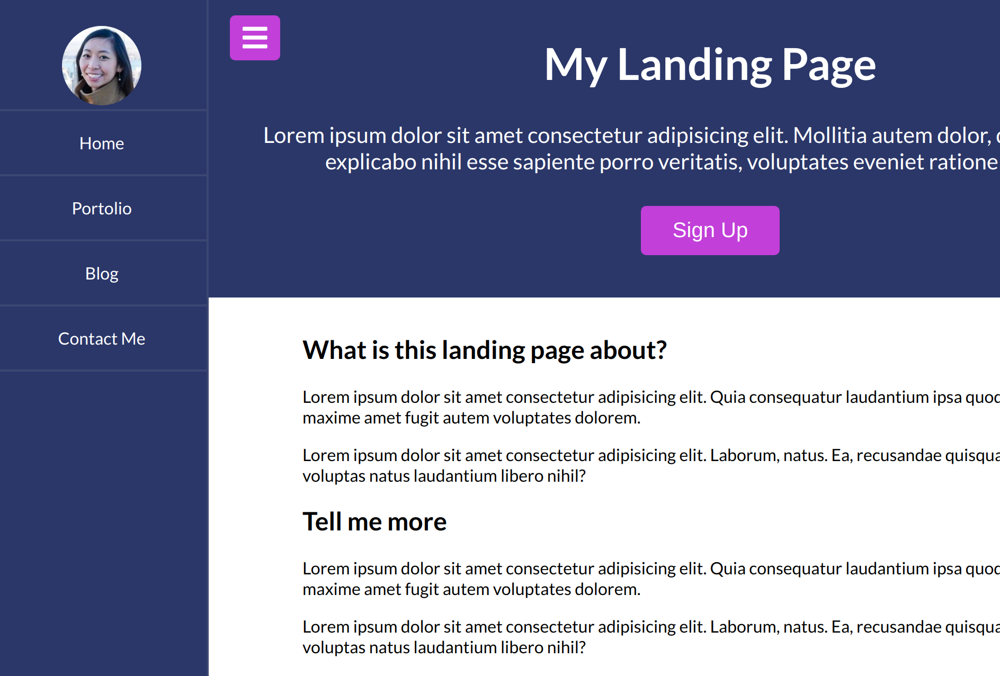

# menu-slider

Simple applicatin with menu slider and sign-up modal, built using vanilla JavaScript

### Functions:

[The app](https://tn-space.github.io/menu-slider/)

The app:

- show or hide the nav
- show sign-up form on click
- hide sign-up form either by clicking 'x' button, or anywhere outside the form.

### Images:

